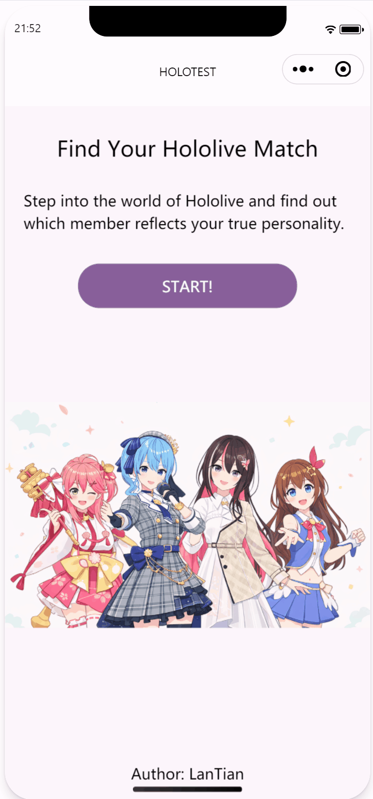

# Holotest WeApp

### Overview

A Hololive personality matching WeChat Mini Program built with **Taro**, **React**, and **TypeScript**.

This is a practice project that matches users with a Hololive member based on a personality questionnaire. The underlying logic is inspired by MBTI-style dimensional mapping, but the final result is presented as a **character match** rather than a personality type.

### Demo

<p align="center">
  
</p>


## 🚀 Quick Start

### Install dependencies

```bash
npm install
```

### Run in WeChat Mini Program mode

```bash
npm run dev:weapp
```

Then open the generated `dist` directory in **WeChat Developer Tools**.


## ✨ Features

* 10-question A/B personality quiz
* Full navigation flow: **Start → Questions → Result → Return**


## 🛠 Tech Stack

* Taro 3.6.28
* React 18
* TypeScript 4.1


## 📂 Project Structure

```text
src/
 ├─ assets/
 ├─ components/
 ├─ data/
 │   ├─ questions.json
 │   └─ results.json
 ├─ pages/
 │   ├─ index/
 │   ├─ question/
 │   └─ result/
 ├─ utils/
 └─ app.ts
```


## 📄 Acknowledgements

This project is created for **learning and practice purposes only**.
All Hololive character images and related intellectual property belong to **COVER Corp.**
No commercial use is intended.

If any content raises copyright concerns, it will be removed upon request.
